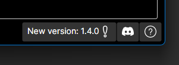
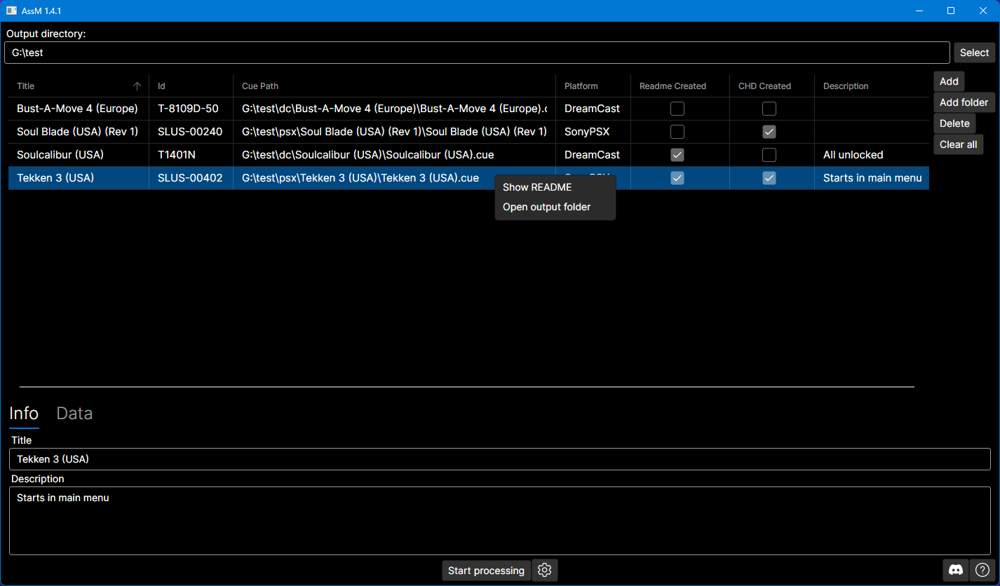
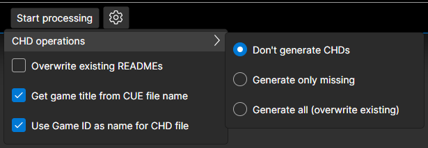

# AssM - Arkadyzja savestates Manager

It is a piece of software that assists in creating entries for [Arkadyzja savestates repository](https://github.com/ActionPL/duckstation_openbios_savestates). It allows creating and editing README files for games that will have savestates uploaded to the repository. Those savestates will then be available for [Arkadyzja](https://arkadyzja.honmaru.pl/).

## ⚠️ Requirements
For the application to work [.NET framework 8](https://dotnet.microsoft.com/en-us/download/dotnet/8.0) is required. 

Application is developed and tested on Windows 11 OS. In theory should also work on Linux/Mac hovewer it was not tested on those platforms (only a bit on Linux and not at all on Mac) and currently only Win and Linux builds are released (see below).

## 📦 Releases
Each release starting with 1.4.0 has four variants:
- Windows x64 version with .NET 8 framework bundled (AssM_X.X.X_with_dotnet-win-x64.zip)
- Windows x64 version without .NET 8 framework bundled (AssM_X.X.X-win-x64.zip)
- Linux x64 version with .NET 8 framework bundled (AssM_X.X.X_with_dotnet-linux-x64.zip)
- Linux x64 version without .NET 8 framework bundled (AssM_X.X.X-linux-x64.zip)

_**Linux releases are highly experimental, use at your own risk!**_

The application has some basic new version check implemented. When it detects that new version is available, this button will be shown:\

Clicking it will open default browser on the latest release page.

## 🪧 Usage

- get latest version of the application from [Releases](https://github.com/SubZeroPL/AssM/releases) page
- unpack to some empty directory
- run the `AssM.exe` file (or `AssM` for Linux)

First you should select Output directory, where the created README files will be stored. The files are created in a specific directory structure:
`OutputPath\Platform\GameID`.\
The output directory is saved between sessions, so when you start the application next time it will be automatically read and existing entries inserted into the table.\
**You should not modify existing directory structure if you plan to use the output directory again later!**
The fields `Title` and `Description` can be freely edited, the changes are reflected immediately in the table.

Then you can use `Add` and `Add folder` buttons to add more source `.cue` files

When you click `Start processing` the application will go through the list and perform required operations according to the configuration.

## ⚙️ Configuration

- Get game title from CUE file name - by default game name is extracted from cue/bin image, this option uses CUE file name instead
- Use Game ID as name for CHD file - by default game title (as set by previous option) is used for CHD file name, this option uses Game ID instead

Other configuration options should be self-explanatory.

## 📝 TODO
- some nice icon
- [you tell me](https://github.com/SubZeroPL/AssM/issues)

## 🔗 Dependencies
This application uses the following external libraries:
- [Avalonia UI](https://avaloniaui.net/) for user interface creation.
- [Avalonia.Labs.Gif](https://github.com/AvaloniaUI/Avalonia.Labs) for animated GIF display
- [DiscTools](https://github.com/SubZeroPL/DiscTools) for reading metadata from game images (with some modifications from [original](https://github.com/Asnivor/DiscTools))
