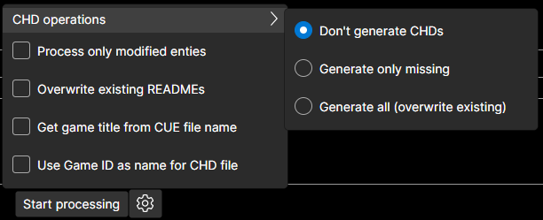

# AssM - Arkadyzja savestates Manager

It is a piece of software that assists in creating entries for [Arkadyzja savestates repository](https://github.com/ActionPL/duckstation_openbios_savestates). It allows creating and editing README files for games that will have savestates uploaded to the repository. Those savestates will then be available for [Arkadyzja](https://arkadyzja.honmaru.pl/).

## Requirements
For the application to work [.NET framework 8](https://dotnet.microsoft.com/en-us/download/dotnet/8.0) is required. 

Application is developed and tested on Windows 11 OS. In theory should also work on Linux/Mac hovewer it was not tested on those platforms and the functionality will be reduced (no creation of CHD files because of only Windows version of CHDMAN is provided).

## Usage

- get latest version of the application from Releases page
- extract to some empty directory
- run the AssM.exe file

First you should select Output directory, where the created README files will be stored. The files are created in a specific directory structure:
`OutputPath\Platform\GameID`.\
The output directory is saved between sessions, so when you start the application next time it will be automatically read and existing entries inserted into the table.\
**You should not modify existing directory structure if you plan to use the output directory again later!**
The fields `Title` and `Description` can be freely edited, the changes are reflected immediately in the table.

Then you can use `Add` and `Add folder` buttons to add more source `.cue` files

When you click `Start processing` the application will go through the list and perform required operations according to the configuration.

## Configuration

- Get game title from CUE file name - by default game name is extracted from cue/bin image, this option uses CUE file name instead
- Use Game ID as name for CHD file - by default game title (as set by previous option) is used for CHD file name, this option uses Game ID instead

Other configuration options should be self-explanatory.